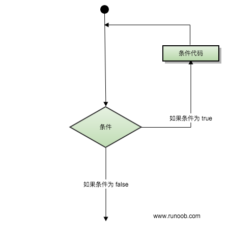
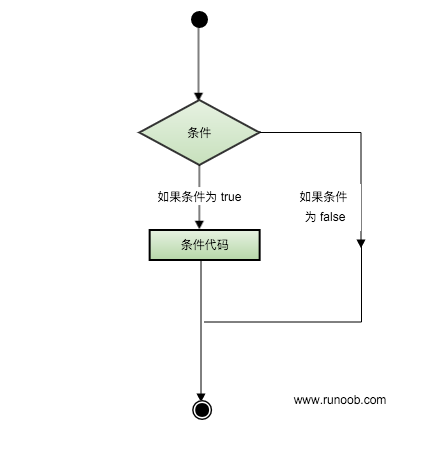

# 循环
很多情况下我们需要执行一些有规律的重复性操作，因此在程序中就需要重复执行某些语句。一组被重复执行的语句被称为循环体，能否继续重复，决定循环的终止条件。

循环语句是由循环体和循环的终止条件两部分组成的

Lua 语言提供了一下几种循环方式处理:
1. while循环：在条件为true时，让程序重复的执行某些语句。执行语句前会先检查条件是否为true.
2. for循环：重复执行指定语句，重复次数可在for语句中控制.
3. repeat...until：重复执行循环，直到指定的条件为真时为止.
4. 循环嵌套：可以在循环内嵌套一个或多个循环语句(while do ... end; for ... do .. end; repeat ... until;) 

## 循环控制语句
循环控制语句用于控制程序的流程。以实现程序的各种结构方式。
Lua支持一下几种循环控制语句：
break语句：退出当前循环或语句，并开始脚本执行紧接着的语句
goto语句：将程序的控制点转移到一个标签处

## 无限循环
在循环中如果条件永远为true循环语句就会永远执行下去，一下以while循环为例：
~~~lua
while(true)
    do 
    print("循环永远执行下去")
end
~~~

# Lua流程控制
Lua 编程语言流程控制语句通过程序设定一个或多个条件语句来设定。在条件为 true 时执行指定程序代码，在条件为 false 时执行其他指定代码。

控制结构的条件表达式结果可以是任何值，Lua认为false和nil为假，true和非nil为真。

要注意的是Lua中 0 为 true：
~~~lua
if(0)
    then
    print("0为true")
end
~~~

Lua提供以下控制语句
if：if语句由一个布尔表达式作为判断条件，其后紧跟着其他语句组成
if...else：if语句可以与else语句搭配使用，在if条件表达式为false时可执行else语句代码。
if嵌套语句：你可以在if或者else if中使用一个或多个if或else if语句